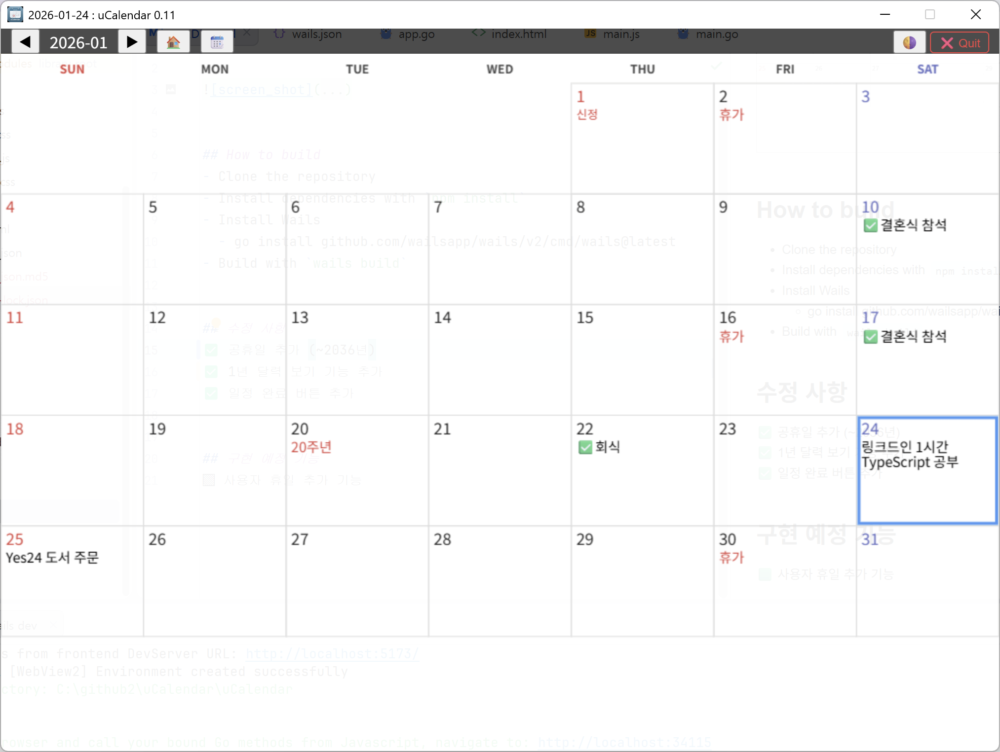
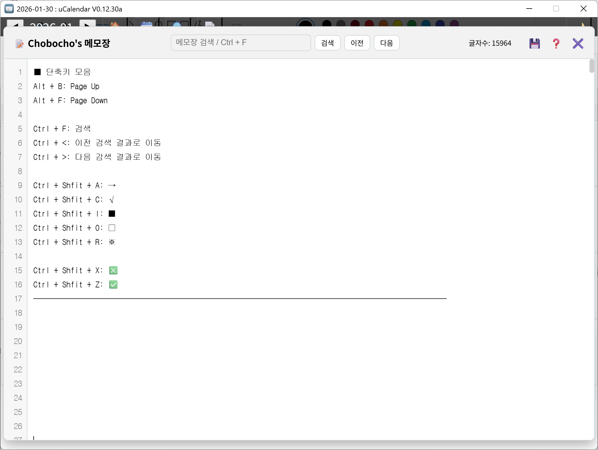

# uCalendar

  
  

## How to build
- Clone the repository
- Install dependencies with `npm install`
- Install Wails 
  - go install github.com/wailsapp/wails/v2/cmd/wails@latest
- Build with `wails build`

## 구현 사항  
✅ 공휴일 추가 (~2036년)  
✅ 1년 달력 보기 기능 추가  
✅ 일정 완료 버튼 추가  
✅ 일정 수정 기능 추가    
✅ 일정 검색 기능 추가    
✅ # 으로 시작하면 영어 단어로 인식 하도록 구현    
✅ ＠ 으로 시작하면 메모로 인식 하도록 구현  
✅ 메모장에서 URL 드래그 후 마우스 우 클릭시 브라우저로 링크 열림  

## 구현 예정 기능
🟩 사용자 휴일 추가 기능  
🟩 일정 DB HTML로 추출 하는 기능   
🟩 일정 카테고리 선택 기능   
🟩 시간 추가 기능  
🟩 주간 달력 기능  
🟩 TASK 추가 기능  
🟩 알림 기능  
🟩 일정 DB Excel 형식으로 추출 하는 기능  
🟩 Excel 파일로 일정 DB 업데이트 기능  

